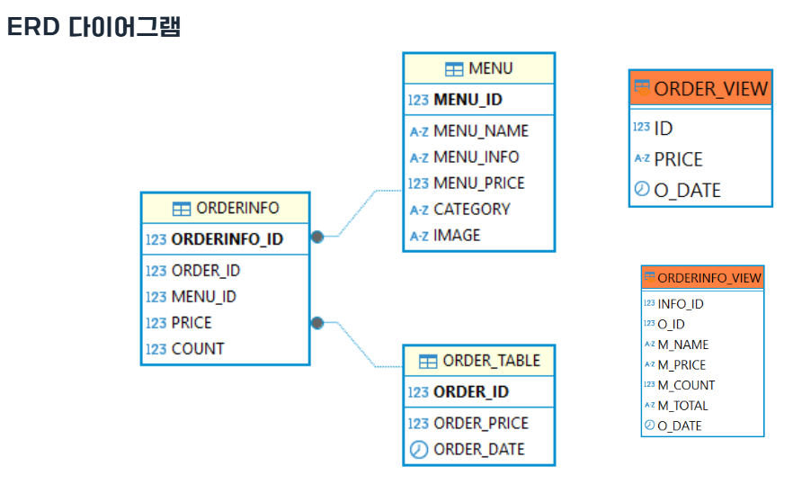
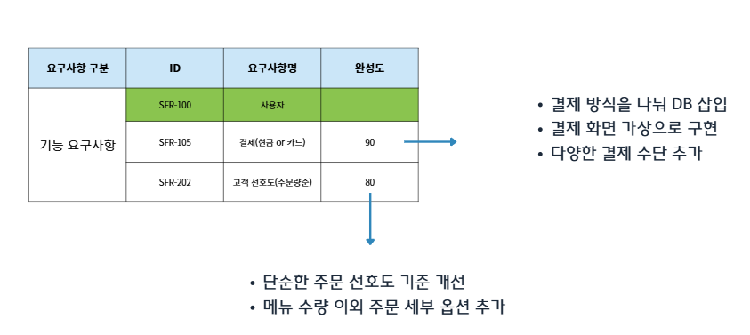

# ☕ 카페 키오스크 시스템 ☕

> **개발 기간**: 2025.03.25 ~ 2025.03.31  
> **팀 구성**: 엄보성, 안정민, 박유빈, 양은지

---

## 🧩 프로젝트 소개

이 프로젝트는 **이디야커피 웹사이트의 음료 데이터를 크롤링하여 키오스크 시스템을 구현**하는 미니 프로젝트입니다.  
주요 목표는 실사용자 관점에서의 **직관적인 UI**, **메뉴 주문**, **결제**, **관리자 기능**을 포함한 **기본적인 키오스크 로직 구현**입니다.

---

## 🔧 개발 환경 및 기술 스택

| 구분         | 사용 기술/도구          |
| ------------ | ----------------------- |
| 언어         | Python 3.13             |
| 크롤링       | BeautifulSoup, Requests |
| 데이터베이스 | Oracle 11g / cx_Oracle  |
| 분석 도구    | Jupyter Notebook        |
| 버전 관리    | Git / GitHub            |
| 협업 도구    | VSCode, DBeaver, Notion |

---

## ✨ 주요 기능

### 👨‍🍳 사용자 기능

- 카테고리별 메뉴 조회 (커피, 음료, 차, 플랫치노 등)
- 메뉴 선택 및 장바구니 담기
- 주문 및 총 결제금액 확인

### 👩‍💼 관리자 기능

- 메뉴 등록/수정/삭제
- 일별 주문 통계, 인기메뉴 집계
- 총 매출 및 주문 내역 확인 (뷰 사용)

### 📝 요구사항 명세서

[요구사항 명세서 상세](./요구사항정리명세서.md)

---

## 🛠 구현 흐름

1. **크롤링**

   - 이디야커피 AJAX API 사용
   - 메뉴명, 설명, 이미지 URL, 가격 등 수집

2. **DB 저장**

   - Oracle DB에 `MENU`, `ORDER_TABLE`, `ORDERINFO` 테이블 구성
   - 샘플 주문 데이터 삽입

3. **조회 및 기능 구현**
   - Python 또는 SQL로 메뉴/주문/통계 출력
   - 관리자용 뷰(view)로 요약 집계

---

## 📊 ERD

---

## ✅ 추후 보완점

---
